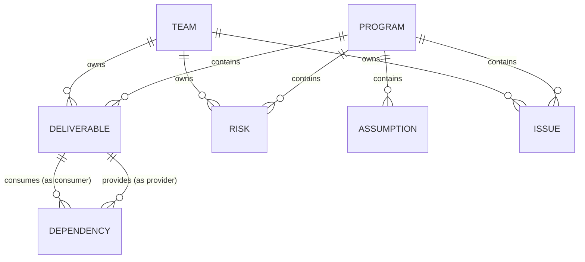

# Roadmap — Cross-Team RAID & Dependency Tracker

*(Phased build plan + data-model reference.)*

A portfolio project for Technical Project/Program Manager roles. The goal is to demonstrate both engineering ability and program-management judgment. The differentiator is not the RAID CRUD — it's the **dependency graph, cascade (impact) analysis, and cycle detection**. Build depth there; keep everything else lean.

---

## Guiding design decisions

Three modeling choices carry the whole "this person has run programs" signal. Lead the case study with these.

1. **Dependencies are edges, not rows in a list.** They connect nodes that can themselves be blocked, which is what makes cascade analysis possible. A flat dependency list is a toy; a graph is the real thing.
2. **Deliverables are the graph nodes.** A dependency isn't "Team A depends on Team B" in the abstract — it's "Team A's deliverable X needs Team B's deliverable Y by a date." Modeling a `Deliverable` node is what lets slippage propagate downstream rigorously.
3. **Separate `needed_by_date` from `committed_date` and surface the gap.** A dependency can look green on its own while its provider is blocked upstream. Catching that *emergent* risk is the feature that reads as program-management maturity.

---

## Data model

### Entity overview

| Entity | Role | Notes |
|---|---|---|
| `Program` | Top-level grouping (optional) | Scopes a set of teams' work; the unit you'd report on |
| `Team` | Owning org unit | Has a color for graph rendering |
| `Deliverable` | **Graph node** | A unit of work a team owns; the thing dependencies connect |
| `Dependency` | **Graph edge** | Provider deliverable → consumer deliverable; carries dates + RAG |
| `Risk` | R in RAID | Probability × impact scoring |
| `Assumption` | A in RAID | Needs validation by a date |
| `Issue` | I in RAID | An active problem (a risk that materialized) |
| `StatusChange` | Audit log (stretch) | Powers the "what changed this week" digest |

**Convex conventions applied below:** every document gets `_id` and `_creationTime` for free, so the explicit `id` fields go away. Foreign keys become typed references — `program_id → Program` becomes `programId: v.id("programs")`. These references are *not* enforced by the database (no FK constraints), so integrity is your code's job. Define everything in `schema.ts` with `defineTable`, and add `.index()` on the fields you filter/traverse by (`by_program`, and on Dependency, `by_provider` and `by_consumer` — those two indexes are what make cascade traversal fast).

### Fields

**Program**
- `id`, `name`, `description`
- `start_date`, `target_date`, `status` (`planning` | `active` | `at_risk` | `done`)

**Team**
- `id`, `name`, `lead_name`
- `color` (hex, for graph nodes/edges)

**Deliverable** — *graph node*
- `id`, `program_id` → Program, `owning_team_id` → Team
- `title`, `description`
- `status` (`not_started` | `in_progress` | `blocked` | `done`)
- `target_date`, `actual_date` (nullable until done)

**Dependency** — *graph edge*
- `id`
- `provider_deliverable_id` → Deliverable (the thing being waited on)
- `consumer_deliverable_id` → Deliverable (the thing waiting)
- `description`
- `needed_by_date` — when the consumer needs it
- `committed_date` — when the provider says it'll be ready
- `rag` (`green` | `amber` | `red`) — can be manually set *and* auto-derived (see cascade)
- Derived (not stored): `slack_days = needed_by_date − committed_date` (negative = at risk on its own)

  (Note: an earlier `is_blocking` flag was removed — every dependency is a hard block. See ADR-0010.)

**Risk**
- `id`, `program_id`, `owning_team_id`, `title`, `description`
- `probability` (1–5), `impact` (1–5), `score` (computed = prob × impact)
- `mitigation`, `owner_name`
- `status` (`open` | `mitigating` | `closed`)

**Assumption**
- `id`, `program_id`, `title`, `description`
- `validation_status` (`unvalidated` | `validated` | `invalidated`)
- `validate_by_date`, `owner_name`

**Issue**
- `id`, `program_id`, `owning_team_id`, `title`, `description`
- `severity` (`low` | `medium` | `high` | `critical`)
- `status` (`open` | `in_progress` | `resolved`)
- `resolution`, `raised_date`, `resolved_date`

**StatusChange** *(stretch)*
- `id`, `entity_type`, `entity_id`, `field`, `old_value`, `new_value`, `changed_at`

### Relationships (ER sketch)

The relationships hold conceptually, but in Convex they're `v.id(...)` references rather than enforced foreign keys. When you delete a Deliverable, nothing cascades automatically — you delete its inbound/outbound Dependencies in the same mutation, or you'll leave dangling edges that break the graph. Worth a mutation helper so you never forget.

### A modeling tradeoff worth writing about

Risks, Assumptions, and Issues share most fields (title, description, owner, status, program). On Convex the question isn't tables-vs-STI — it's how you shape documents. Two defensible options:

- **Separate tables — `risks`, `assumptions`, `issues` (recommended here):** each `defineTable` carries only its own fields with its own `v.union(...)` validators, so the schema documents itself and type-specific fields are properly typed and required. Slight duplication of the shared fields. Reads cleanly and is easy to query per type. Best for a portfolio piece.
- **One `raidItems` table with a `type` discriminant:** a single table whose validator is a `v.union` of the three shapes. Less duplication, but every query filters by `type` and the union types make the code fussier. Convex's validators make this cleaner than a SQL JSONB blob would be — so it's a legitimate choice, just more to defend.

Either way, lean on Convex's schema validators — that's the equivalent of the constraints you'd otherwise get from a relational DB, and being able to say "I enforced integrity at the validator layer since the DB doesn't do FKs" is a good interview answer.

Dependencies stay first-class regardless — they're an edge with real references, not a variant of the others.

---

## Build plan (~9–10 weeks part-time, comfortable before year-end)

The Convex stack trims backend setup and plumbing, so the time saved in Phases 0–1 goes straight into the graph and cascade work — which is where the interview signal lives.

**Recommended stack** (built around tools you already know):
- **Backend + DB + real-time:** **Convex.** Collapses the API/DB/deploy layers into TypeScript functions and gives you live-updating queries and scheduled functions (crons) for free. Its reactive React hooks handle all server state.
- **Frontend:** Next.js (App Router) + TypeScript.
- **Server state:** Convex's own `useQuery`/`useMutation` hooks. **Do not add TanStack Query** — it duplicates what Convex already does; running both is redundant plumbing.
- **Tables/grids:** **TanStack Table** (headless) for the filterable, sortable R/A/I and dependency lists, fed by Convex query results.
- **UI / styling:** **Tailwind CSS + shadcn/ui** — components copied into `components/ui/` (you own and edit them), composed with TanStack Table for the grids.
- **Routing:** built into Next.js (file-based App Router) — no separate router library needed. Note Convex's live hooks run in client components (`"use client"`); use `preloadQuery` for server-rendered first paint where you want it.
- **Graph viz:** **React Flow** (`@xyflow/react` — v12; the old `reactflow` package is v11). Chosen over Cytoscape.js; see ADR-0009. This is where your visual "wow" comes from — don't skimp. Unaffected by the backend choice.
- **Deploy:** Convex hosts the backend; deploy the Next.js frontend to Vercel (its native target).
- **Package manager:** **pnpm** throughout.

Why this fits *this* project: real-time reactivity is on-narrative for a cross-team tool — multiple teams updating status, everyone seeing the live program picture, the cascade rippling downstream the moment a dependency flips red. That's a memorable demo and a coherent story for what the tool is *for*.

### Phase 0 — Setup & scope (~half a week)
Convex collapses most of this. Scaffold with `pnpm create next-app`, add Convex (`pnpm add convex`) and run `pnpm exec convex dev` to provision `schema.ts`, then `pnpm dlx shadcn@latest init` to set up Tailwind + shadcn/ui. Wire the Next.js app to Convex via a `ConvexClientProvider` in `app/layout.tsx`. No separate API layer, no migrations to hand-roll, no CI-for-backend to babysit. Use the time you save on the graph work. **Write the one-paragraph problem statement now** — that's the opening of your case study.

### Phase 1 — Core RAID CRUD (2 weeks)
Teams, Deliverables, and all four RAID types as Convex mutations/queries, with TanStack Table for the filter-by-team and filter-by-status views. Seed data via a seed mutation. Real-time updates come for free — worth a quick two-browser demo clip even at this stage. This is your walking skeleton — end the phase with something usable, if plain.

### Phase 2 — Dependency graph (1.5–2 weeks)
The centerpiece. Render deliverables as nodes, dependencies as edges, colored by RAG. Show the `needed_by` vs `committed` gap on each edge (tooltip or badge). Let users click a node to see everything it depends on and everything depending on it.

### Phase 3 — The differentiators (2 weeks)
This is the algorithmic signal that separates you from "PM who made a CRUD app":
- **Cascade / impact analysis:** when a provider deliverable slips or a dependency goes red, traverse downstream (topological / DFS) and auto-flag every dependent deliverable and dependency as at-risk. Derive edge RAG from upstream state, not just manual entry. In Convex this is a query/action that loads edges via your `by_provider`/`by_consumer` indexes and walks them in TypeScript — the equivalent of a recursive CTE, but you *own* the algorithm in plain code, which is easier to explain to an interviewer than SQL recursion. That's a feature, not a downside.
- **Cycle detection:** flag circular dependencies (a real program killer) — a clean use of a graph algorithm you can talk through in an interview.

### Phase 4 — Dashboard & roll-ups (1 week)
Per-team health, at-risk counts, red/amber/green totals, program-level summary. What a TPM opens on Monday morning.

### Phase 5 — One "wow" automation (1 week)
Auto-generate a **weekly status digest** — "here's what went at-risk this week, and why" — from the StatusChange log. With Convex this is a real **scheduled function (cron)** that runs every Friday, not a button you press — which upgrades it from a demo trick to something that reads as a genuine TPM artifact. Generating the digest text is enough; wiring it to email/Slack via a Convex action is an easy bonus if time allows.

### Phase 6 — Polish, seed, package (1–1.5 weeks + buffer)
Seed a **realistic multi-team demo program** so a visitor sees value in three seconds (empty apps kill portfolio pieces). Write the case study, record a 2–3 min Loom walkthrough, add it to your LinkedIn Featured section with the live demo + repo + writeup.

---

## Scope discipline

RAID trackers balloon into Jira clones. Resist it. For a portfolio piece, **depth on graph + cascade + cycle detection beats breadth of features every time.** If you're short on time, cut Assumptions/Issues to bare CRUD before you cut anything from the dependency graph story.

## What the case study should say

- The problem, in program-management terms (cross-team slippage that nobody sees coming).
- The three design decisions above, and *why* — especially needed-by vs. committed and emergent risk.
- One real engineering tradeoff, e.g. choosing a document DB (Convex) over relational and enforcing integrity at the schema-validator layer instead of via foreign keys; or the R/A/I document-shape choice; or the graph library pick.
- Cascade/cycle detection explained plainly — walking the dependency graph in your own TypeScript rather than leaning on SQL recursion — which shows you can reason about algorithms *and* translate them to stakeholders.
- The real-time angle: why a live-updating cross-team picture matters for program management, not just as a tech demo.
- Outcome: the demo program, a metric or two, the digest it produces.
